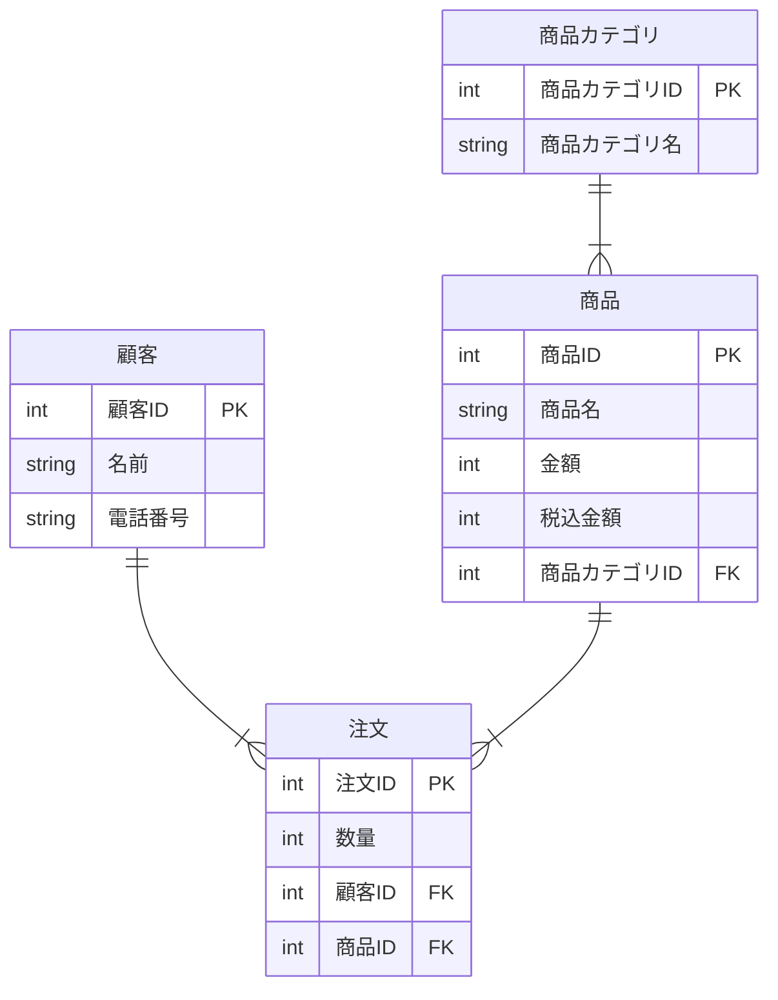

```mermaid
erDiagram
    顧客 {
        int 顧客ID PK
        string 名前
        string 電話番号
    }

    注文 {
        int 注文ID PK
        int 数量
        int 顧客ID FK
        int 商品ID FK
    }

    商品 {
        int 商品ID PK
        string 商品名
        int 金額
        int 税込金額
        int 商品カテゴリID FK
    }

    商品カテゴリ {
        int 商品カテゴリID PK
        string 商品カテゴリ名
    }

    顧客 ||--|{ 注文 : ""
    商品 ||--|{ 注文 : ""
    商品カテゴリ ||--|{ 商品 : ""
```
