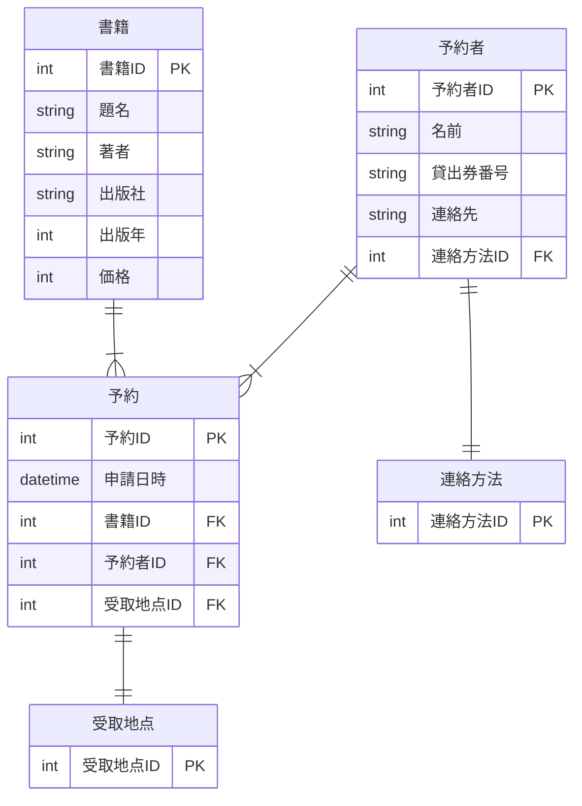

```mermaid
erDiagram
    予約 {
        int 予約ID PK
        datetime 申請日時
        int 書籍ID FK
        int 予約者ID FK
        int 受取地点ID FK
    }

    予約者 {
        int 予約者ID PK
        string 名前
        string 貸出券番号
        string 連絡先
        int 連絡方法ID FK
    }

    受取地点 {
        int 受取地点ID PK
    }

    連絡方法 {
        int 連絡方法ID PK
    }

    書籍 {
        int 書籍ID PK
        string 題名
        string 著者
        string 出版社
        int 出版年
        int 価格
    }

    予約者 ||--|{ 予約 : ""
    書籍 ||--|{ 予約 : ""
    予約 ||--|| 受取地点 : ""
    予約者 ||--|| 連絡方法 : ""
```
