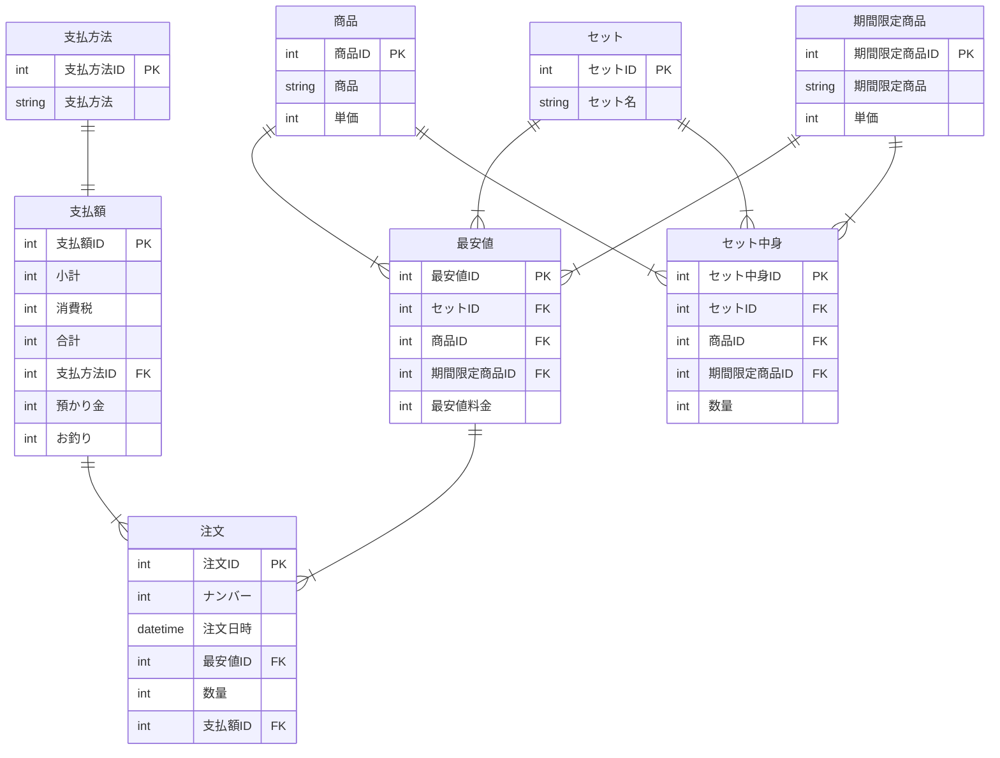

```mermaid
erDiagram
    注文 {
        int 注文ID PK
        int ナンバー
        datetime 注文日時
        int 最安値ID FK
        int 数量
        int 支払額ID FK
    }

    支払額 {
        int 支払額ID PK
        int 小計
        int 消費税
        int 合計
        int 支払方法ID FK
        int 預かり金
        int お釣り
    }

    支払方法 {
        int 支払方法ID PK
        string 支払方法
    }

    商品 {
        int 商品ID PK
        string 商品
        int 単価
    }

    期間限定商品 {
        int 期間限定商品ID PK
        string 期間限定商品
        int 単価
    }

    セット {
        int セットID PK
        string セット名
    }

    セット中身 {
        int セット中身ID PK
        int セットID FK
        int 商品ID FK
        int 期間限定商品ID FK
        int 数量
    }

    最安値 {
        int 最安値ID PK
        int セットID FK
        int 商品ID FK
        int 期間限定商品ID FK
        int 最安値料金
    }

    支払方法 ||--|| 支払額 : ""
    支払額 ||--|{ 注文 : ""
    最安値 ||--|{ 注文 : ""
    商品 ||--|{ 最安値 : ""
    期間限定商品 ||--|{ 最安値 : ""
    セット ||--|{ 最安値 : ""
    セット ||--|{ セット中身 : ""
    商品 ||--|{ セット中身 : ""
    期間限定商品 ||--|{ セット中身 : ""
```
