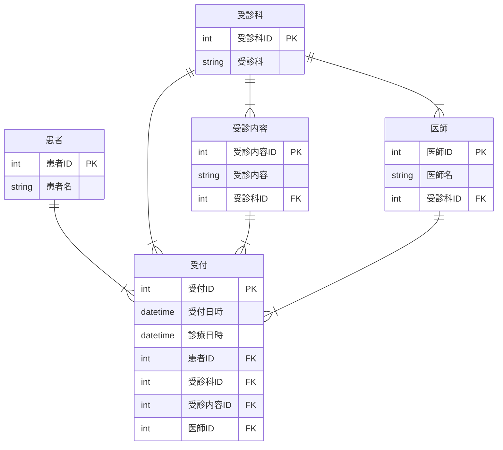

```mermaid
erDiagram
    受付 {
        int 受付ID PK
        datetime 受付日時
        datetime 診療日時
        int 患者ID FK
        int 受診科ID FK
        int 受診内容ID FK
        int 医師ID FK
    }

    患者 {
        int 患者ID PK
        string 患者名
    }

    受診科 {
        int 受診科ID PK
        string 受診科
    }

    受診内容 {
        int 受診内容ID PK
        string 受診内容
        int 受診科ID FK
    }

    医師 {
        int 医師ID PK
        string 医師名
        int 受診科ID FK
    }

    患者 ||--|{ 受付 : ""
    受診科 ||--|{ 受付 : ""
    受診内容 ||--|{ 受付 : ""
    医師 ||--|{ 受付 : ""
    受診科 ||--|{ 受診内容 : ""
    受診科 ||--|{ 医師 : ""
```
