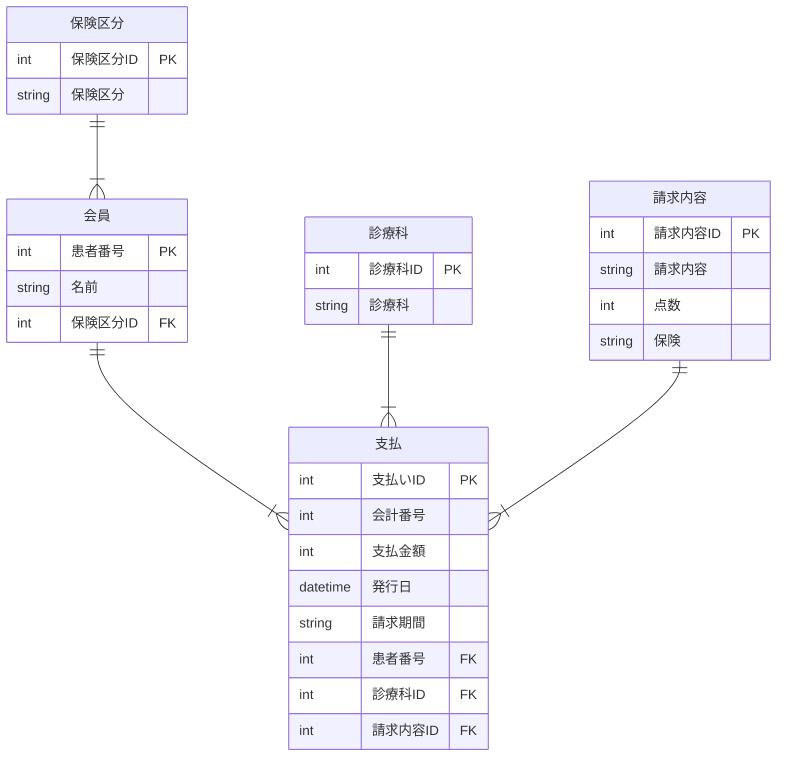

```mermaid id="g9v2mk"
erDiagram
    支払 {
        int 支払いID PK
        int 会計番号
        int 支払金額
        datetime 発行日
        string 請求期間
        int 患者番号 FK
        int 診療科ID FK
        int 請求内容ID FK
    }

    会員 {
        int 患者番号 PK
        string 名前
        int 保険区分ID FK
    }

    診療科 {
        int 診療科ID PK
        string 診療科
    }

    保険区分 {
        int 保険区分ID PK
        string 保険区分
    }

    請求内容 {
        int 請求内容ID PK
        string 請求内容
        int 点数
        string 保険
    }

    会員 ||--|{ 支払 : ""
    診療科 ||--|{ 支払 : ""
    請求内容 ||--|{ 支払 : ""
    保険区分 ||--|{ 会員 : ""
```
